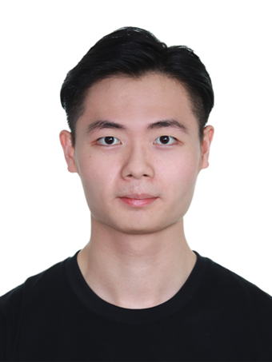
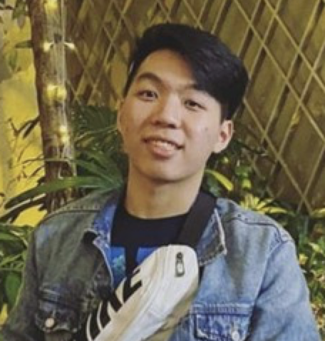

# About Us

We are a team based in the [School of Computing, National University of Singapore](http://www.comp.nus.edu.sg).

You can reach us at the email `e1122875[at]u.nus.edu`

## Project team

### Galven Sim

[[github](https://github.com/inquisitivrx)]
[[portfolio](team/inquisitivrx.md)]

* Role: Tester
* Responsibilities: Ensures the testing of the project is done properly and on time.

### Chee Yang

[[github](https://github.com/GCheeYang)]
[[portfolio](team/johndoe.md)]

* Role: Deliverables and deadlines
* Responsibilities: Ensure project deliverables are done on time and in the right format.

### Sherwin Ee

[[github](https://github.com/sherwinee)]
[[portfolio](team/sherwinee.md)]

* Role: Integration and git expert
* Responsibilities: In charge of versioning of the code, maintaining the code repository, integrating parts of the software to create a whole. Furthermore, help team members with matters related to GitHub.

### Kea Harvan Suyanto

[[homepage](https://keaharvan.vercel.app)]
[[github](https://github.com/kea-S)]
[[portfolio](team/kea.md)]

* Role: Documentation and code quality
* Responsibilities: Responsible for quality of various project documents. Furthermore, looks after code quality ensuring adherence to coding standards.

### Parry Chan

[[github](http://github.com/parrycys)]
[[portfolio](team/parrycys.md)]

* Role: Team lead
* Responsibilities: Responsible for overall project coordination.

