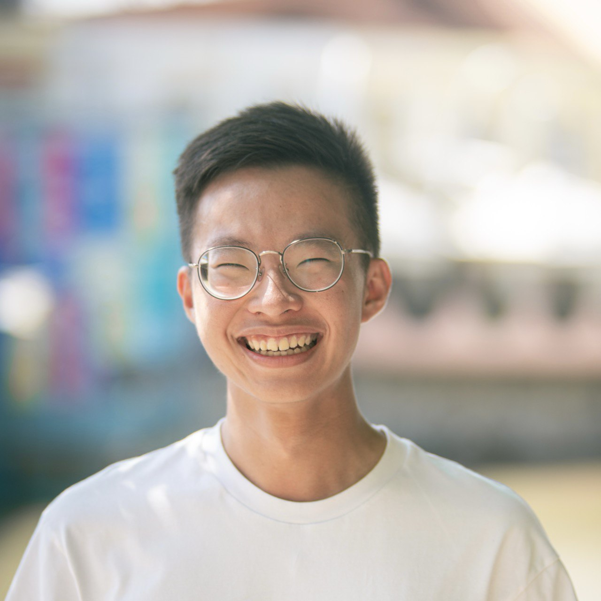

# About Us

We are a team based in the [School of Computing, National University of Singapore](http://www.comp.nus.edu.sg).

You can reach us at the email `seer[at]comp.nus.edu.sg`

## Project team

### Sherwin Ee

[[homepage](http://www.comp.nus.edu.sg/~e1293805)]
[[github](https://github.com/sherwinee)]
[[portfolio](team/sherwinee.md)]

* Role: TBC
* Responsibilities: TBC

### Parry Chan

[[github](http://github.com/parrycys)]
[[portfolio](team/parrycys.md)]

* Role: TBC
* Responsibilities: TBC

### Johnny Doe

[[github](http://github.com/johndoe)] [[portfolio](team/johndoe.md)]

* Role: Developer
* Responsibilities: Data

### Jean Doe

[[github](http://github.com/johndoe)]
[[portfolio](team/johndoe.md)]

* Role: Developer
* Responsibilities: Dev Ops + Threading

### James Doe

[[github](http://github.com/johndoe)]
[[portfolio](team/johndoe.md)]

* Role: Developer
* Responsibilities: UI
