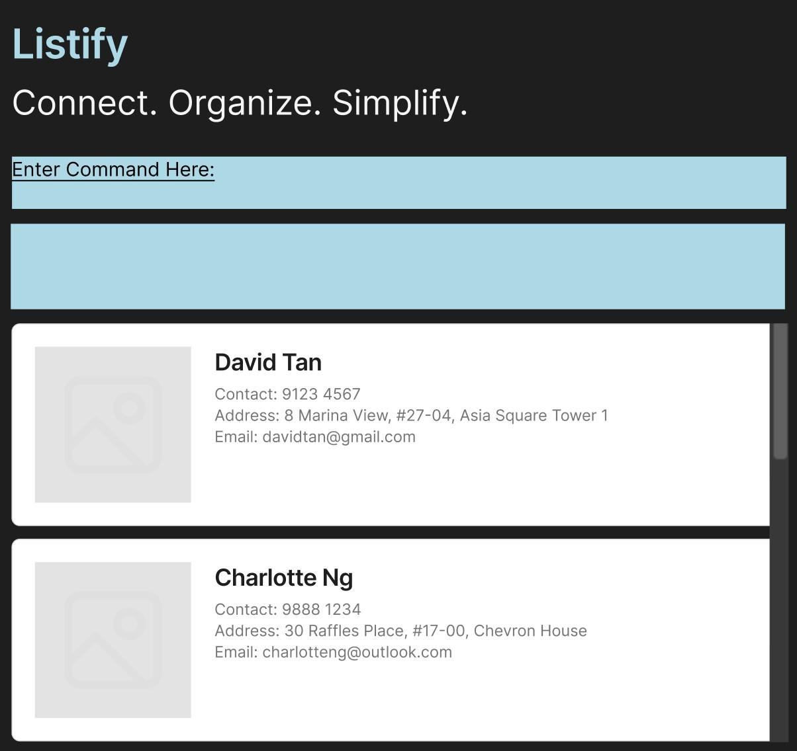
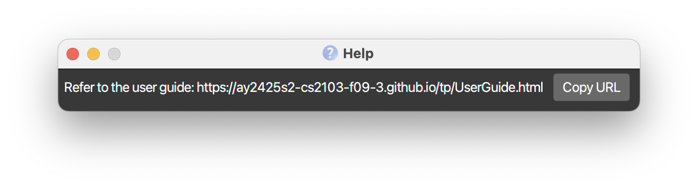

---user
  layout: default.md
  title: "User Guide"
  pageNav: 3
---

# Listify User Guide

Listify is a **desktop app for managing contacts, optimized for use via a Command Line Interface** (CLI) while still having the benefits of a Graphical User Interface (GUI). If you can type fast, Listify can get your contact management tasks done faster than traditional GUI apps.

<!-- * Table of Contents -->
<page-nav-print />

--------------------------------------------------------------------------------------------------------------------

## Quick start

1. Ensure you have Java `17` or above installed in your Computer.<br>
   **Mac users:** Ensure you have the precise JDK version prescribed [here](https://se-education.org/guides/tutorials/javaInstallationMac.html).

1. Download the latest `.jar` file from [here](https://github.com/AY2425S2-CS2103-F09-3/tp/releases).

1. Copy the file to the folder you want to use as the _home folder_ for your Listify App.

1. Open a command terminal, `cd` into the folder you put the jar file in, and use the `java -jar listify.jar` command to run the application.<br>
   A GUI similar to the below should appear in a few seconds. Note how the app contains some sample data.<br>
   

1. Type the command in the command box and press Enter to execute it. e.g. typing **`help`** and pressing Enter will open the help window.<br>
   Some example commands you can try:

   * `list` : Lists all contacts.

   * `add n/John Doe p/98765432 e/johnd@example.com a/John street, block 123, #01-01 r/Vendor` : Adds a contact named `John Doe` to the Address Book.

   * `delete 3` : Deletes the 3rd contact shown in the current list.

   * `clear` : Deletes all contacts.

   * `exit` : Exits the app.

1. Refer to the [Features](#features) below for details of each command.

--------------------------------------------------------------------------------------------------------------------

## Features

<box type="info" seamless>

**Notes about the command format:**<br>

* Words in `UPPER_CASE` are the parameters to be supplied by the user.<br>
  e.g. in `add n/NAME`, `NAME` is a parameter which can be used as `add n/John Doe`.

* Items in square brackets are optional.<br>
  e.g `n/NAME [t/TAG]` can be used as `n/John Doe t/friend` or as `n/John Doe`.

* Items with `…`​ after them can be used multiple times including zero times.<br>
  e.g. `[t/TAG]…​` can be used as ` ` (i.e. 0 times), `t/friend`, `t/friend t/family` etc.

* Parameters can be in any order.<br>
  e.g. if the command specifies `n/NAME p/PHONE_NUMBER`, `p/PHONE_NUMBER n/NAME` is also acceptable.

* Extraneous parameters for commands that do not take in parameters (such as `help`, `list`, `exit` and `clear`) will be ignored.<br>
  e.g. if the command specifies `help 123`, it will be interpreted as `help`.

* If you are using a PDF version of this document, be careful when copying and pasting commands that span multiple lines as space characters surrounding line-breaks may be omitted when copied over to the application.
</box>

<box type="info" seamless>

**Maximum Number of Contacts:**<br>
The maximum number of contacts that Listify supports is limited to the _Java Integer Max Value_ supported by the system running Listify.
</box>

<box type="info" seamless>

**Duplicate Contacts Detection**<br>
The app identifies duplicate contacts by checking if either the **Phone Number**, **Email**, or _both_ are exactly the same.
</box>

### Viewing help : `help`

Shows a message explaining how to access the help page.



Format: `help`


### Adding a person: `add`

Adds a person to the address book.

Format: `add n/NAME p/PHONE_NUMBER e/EMAIL a/ADDRESS r/ROLE [t/TAG]…​`
<box type="tip" seamless>

**Tip:** A person can have any number of tags (including 0)
</box>

Examples:
* `add n/John Doe p/98765432 e/johnd@example.com a/John street, block 123, #01-01 r/Vendor`
* `add n/Betsy Crowe t/friend e/betsycrowe@example.com a/Newgate Prison p/1234567 r/Software Engineer t/criminal`

### Listing all persons : `list`

Shows a list of all persons in the address book.

Format: `list`

### Editing a person : `edit`

Edits an existing person in the address book.

Format: `edit INDEX [n/NAME] [p/PHONE] [e/EMAIL] [a/ADDRESS] [r/ROLE] [t/TAG]…​`

* Edits the person at the specified `INDEX`. The index refers to the index number shown in the displayed person list. The index **must be a positive integer** 1, 2, 3, …​
* At least one of the optional fields must be provided.
* Existing values will be updated to the input values.
* When editing tags, the existing tags of the person will be removed i.e adding of tags is not cumulative.
* You can remove all the person’s tags by typing `t/` without
    specifying any tags after it.

Examples:
*  `edit 1 p/91234567 e/johndoe@example.com` Edits the phone number and email address of the 1st person to be `91234567` and `johndoe@example.com` respectively.
*  `edit 2 n/Betsy Crower t/` Edits the name of the 2nd person to be `Betsy Crower` and clears all existing tags.

### Locating persons by name/phone/tag/role: `find`

Finds persons whose name/phone/tag/role contain any of the given keywords.

Format: `find PREFIX/KEYWORD [PREFIX/MORE_KEYWORDS]`

* The contacts will be searched based on the given prefix to be searched
* Different prefixes can not be used together
  e.g. `find n/hans p/98763547` will result in an error
* Keywords are seperated by prefix
  e.g. `find n/Hans Gruber n/Bo Yang` has keywords `Hans Gruber`, `Bo Yang`
* #### Name, role, and tag search
* The search is case-insensitive. e.g `find n/hans` will show `Hans Gruber`
* Partial keywords **which includes whitespace** will be matched
e.g. `find n/Hans G` will match `Hans Gruber` but `find n/Han   G` will not match
* Persons partially matching at least keyword one will be returned (i.e. `OR` search)
  e.g. `find n/Hans n/Bo` will return `Hans Gruber`, `Bo Yang`
* #### Phone search
* find by phone will not allow whitespaces
e.g. `find p/98763547 98761234` results in an error - instead use `find p/98763547 p/98761234`

Examples:
* `find n/John` returns `john` and `John Doe`
* `find r/Software` returns `Software` and `Software Engineer`
* `find n/alex n/david` returns `Alex Yeoh`, `David Li`<br>
  

### Deleting a person : `delete`

Deletes the specified person from the address book.

Format: `delete INDEX`

* Deletes the person at the specified `INDEX`.
* The index refers to the index number shown in the displayed person list.
* The index **must be a positive integer** 1, 2, 3, …​

Examples:
* `list` followed by `delete 2` deletes the 2nd person in the address book.
* `find n/Betsy` followed by `delete 1` deletes the 1st person in the results of the `find` command.

### Deleting multiple people : `deletewithtag`

Deletes all the people with a matching tag from the address book.

Format: `deletewithtag TAGNAME`

* Deletes all people with the specified `TAGNAME`.
* The tagname refers to a tag a person is associated with, shown in the displayed person list.
* The tagname **must be an exact match (case-insensitive) to the tag name of the desired persons(s) to delete**.

Examples:
* `list` followed by `deletewithtag colleagues` deletes everyone with the tag `colleagues` in listify.

### Sorting contacts : `sort`

Sort the address book in ascending or descending order by name or by phone if there are duplicate names.

Format: `sort ORDER`

* Sort the list of contacts by name or by phone if there are duplicate names in ascending or descending order.
* The original order of the list will be retained after using `sort` to aid in further operations or after closing the application.

Examples:
* `list` followed by `sort asc` sorts the list of contacts by name or by phone if there are duplicate names in ascending order.
* `list` followed by `sort desc` sorts the list of contacts by name or by phone if there are duplicate names in descending order.

### Mark person as contacted : `contact`

Marks a person as contacted at the current date and time.

Format: `contact INDEX`

* Marks the person as contacted at the specified `INDEX`.
* The index refers to the index number shown in the displayed person list.
* The index **must be a positive integer** 1, 2, 3, …​
* The contacted field of the person will be changed to 'Last Contacted: dd mmm yyyy hh:mm'.
* The contacted field will not be imported or exported as this field is not part of the contact and is for the user to reference while using the application.

Examples:
* `list` followed by `contact 2` changes the status of the 2nd person in the address book to 'Last Contacted: <Current Date & Time>'.
* `find n/Betsy` followed by `contact 1` marks the 1st person in the results of the `find` command as contacted at the current date & time.

### Exporting all contacts : `export`

Exports all contacts in the app (viewable with the `list` command) into a `vcf` (Vcard) or a proprietary
`csv` (Comma Separated Vector) file. `vcf` files can be imported into common contact applications.

Format: `export FILENAME`

* Filenames must end with `.vcf` or `.csv`, the programme will automatically export them to the respective format
* Exported files are created in the programme's `exports` folder
* Tags are NOT exported in the `vcf` format
* Last-contacted times are NOT exported

Examples:
* `export contacts.vcf` exports all contacts to a vcf file at `exports/contacts.vcf`
* `export contacts_dump.csv` exports all contacts to a csv file at `exports/contacts_dump.csv`

### Importing contacts : `import`

Import contacts from CSV or VCF files into the address book.

Format: `import FILENAME`

* `FILENAME` : The name of the file to import (must end with .csv or .vcf).
* The file must be located in the `imports/` directory of the application.

Examples:
* `import addressbook.csv`: Imports contacts from a CSV named `addressbook.csv`.
* `import contacts.vcf`: Imports contacts from a VCF named `contacts.vcf`.

#### CSV Format
* The first row must be the header: `Name,Phone,Email,Address,Role,Tags`.
* Each subsequent row represents one contact.
* Tags are optional and can be separated by commas or semicolons.

Example:<br>
```
Name,Phone,Email,Address,Role,Tags
Alice Pauline,94351253,alice@example.com,123 Jurong West Ave 6 #08-111,Organizer,friends;colleagues
```

#### VCF Format
* Must follow standard vCard file format.
* Name must be present in a single `FN` field.
* There must be one and only one `TEL`, `EMAIL` and `ADDRESS` field.
* Role is parsed from the `TITLE` field (defaults to "Unassigned" if missing).
* All other fields are ignored.

Example:
```
BEGIN:VCARD
VERSION:4.0
FN:Alice Pauline
TEL:98761234
EMAIL:alice@example.com
ADR:PO Box 123;Suite 456;123 Jurong West Ave 6 #08-111;Singapore;Central;600123;Singapore
TITLE:Organizer
END:VCARD
```

### Clearing all entries : `clear`

Clears all entries from the address book.

**Warning: The `clear` command is irreversible.**<br>

* Once executed, all entries will be permanently deleted from the address book.
* There is currently no `undo` command to restore deleted entries.
* Future versions may include an `undo` feature, but it is not available at this time. Please proceed with caution.
</box>

Format: `clear`

### Exiting the program : `exit`

Exits the program.

Format: `exit`

### Saving the data

Listify data are saved in the hard disk automatically after any command that changes the data. There is no need to save manually.

### Editing the data file

Listify data are saved automatically as a JSON file `[JAR file location]/data/addressbook.json`. Advanced users are welcome to update data directly by editing that data file.

<box type="warning" seamless>

**Caution:**
If your changes to the data file makes its format invalid, Listify will discard all data and start with an empty data file at the next run.  Hence, it is recommended to take a backup of the file before editing it.<br>
Furthermore, certain edits can cause Listify to behave in unexpected ways (e.g., if a value entered is outside the acceptable range). Therefore, edit the data file only if you are confident that you can update it correctly.
</box>


--------------------------------------------------------------------------------------------------------------------

## FAQ

**Q**: How do I transfer my data to another Computer?<br>

**A**: Install the app in the other computer and overwrite the empty data file it creates with the file that contains the data of your previous Listify home folder. 
Alternatively, use the export command to export a csv file of all contacts, and use the import command on the destination computer to import contacts from that file (last-contacted times not transferred). 

--------------------------------------------------------------------------------------------------------------------

## Known issues

1. **When using multiple screens**, if you move the application to a secondary screen, and later switch to using only the primary screen, the GUI will open off-screen. The remedy is to delete the `preferences.json` file created by the application before running the application again.
2. **If you minimize the Help Window** and then run the `help` command (or use the `Help` menu, or the keyboard shortcut `F1`) again, the original Help Window will remain minimized, and no new Help Window will appear. The remedy is to manually restore the minimized Help Window.
3. **When running export command on Windows OS**, if the entered filename already exists in the `exports` directory in a dIfFeReNt CaSe, the contacts will be exported to the existing file with no change to the original filename's case. This is due to Windows filesystem being case-insensitive. The workaround is to delete the file before exporting again.

--------------------------------------------------------------------------------------------------------------------

## Command summary

Action     | Format, Examples
-----------|----------------------------------------------------------------------------------------------------------------------------------------------------------------------
**Add**    | `add n/NAME p/PHONE_NUMBER e/EMAIL a/ADDRESS r/ROLE [t/TAG]…​` <br> e.g., `add n/James Ho p/22224444 e/jamesho@example.com a/123, Clementi Rd, 1234665 r/Software Engineer t/friend t/colleague`
**Clear**  | `clear`
**Delete** | `delete INDEX`<br> e.g., `delete 3`
**Delete with Tag**   | `deletewithtag TAGNAME` <br> e.g., `deletewithtag colleague`
**Edit**   | `edit INDEX [n/NAME] [p/PHONE_NUMBER] [e/EMAIL] [a/ADDRESS] [r/ROLE] [t/TAG]…​`<br> e.g.,`edit 2 n/James Lee e/jameslee@example.com`
**Find**   | `find PREFIX/KEYWORD [PREFIX/MORE_KEYWORDS]`<br> e.g., `find n/James n/Matthew`
**Sort**   | `sort ORDER`<br> e.g., `sort asc`
**Contact**   | `contact INDEX` <br> e.g., `contact 2`
**Import**   | `import FILENAME` <br> e.g., `import contacts.vcf`
**Export** | `export FILENAME`<br> e.g., `export contacts.csv`
**List**   | `list`
**Help**   | `help`
